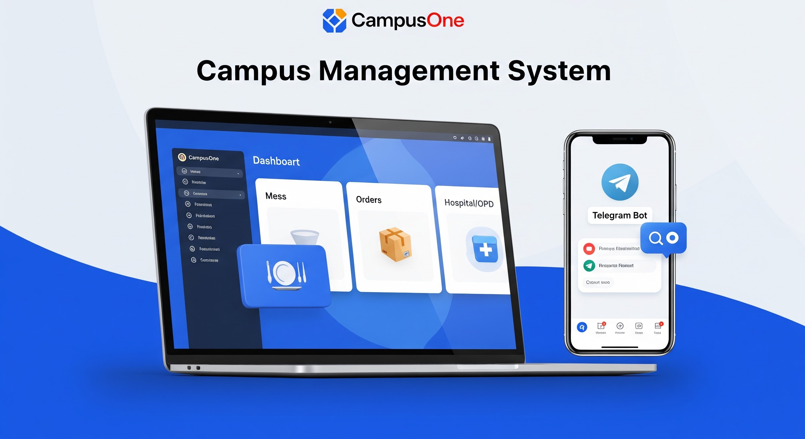
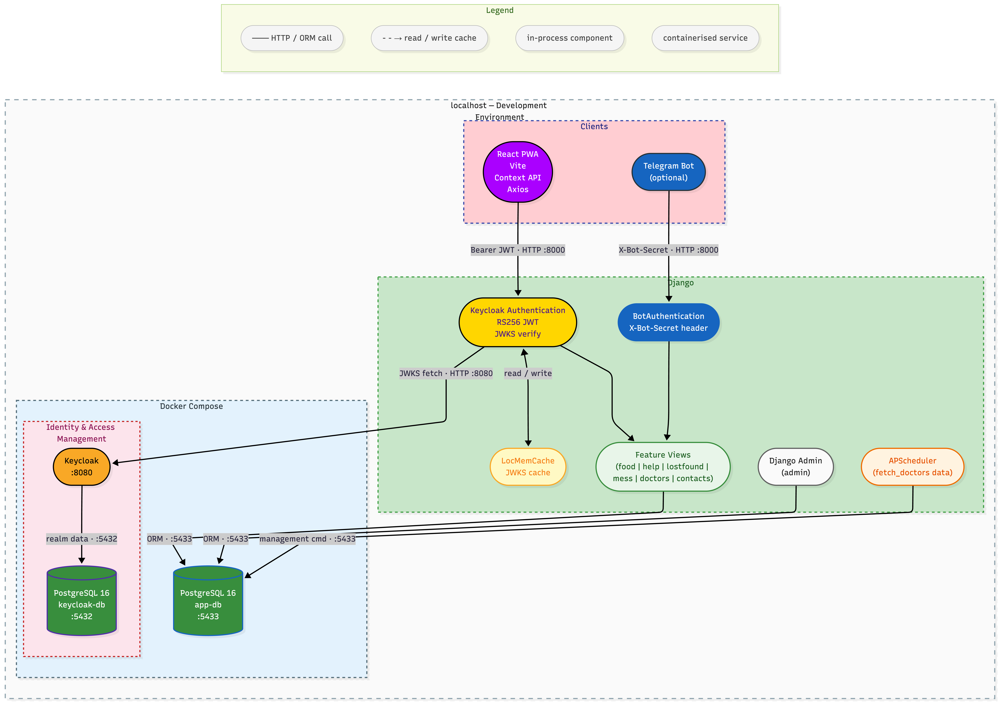
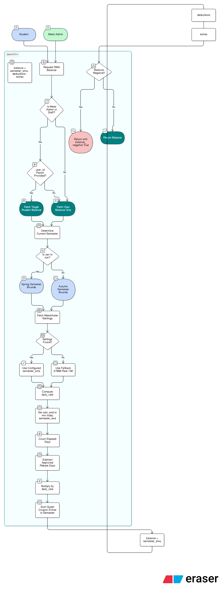
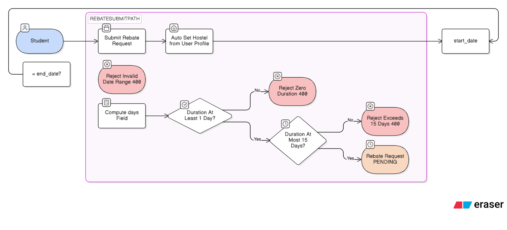
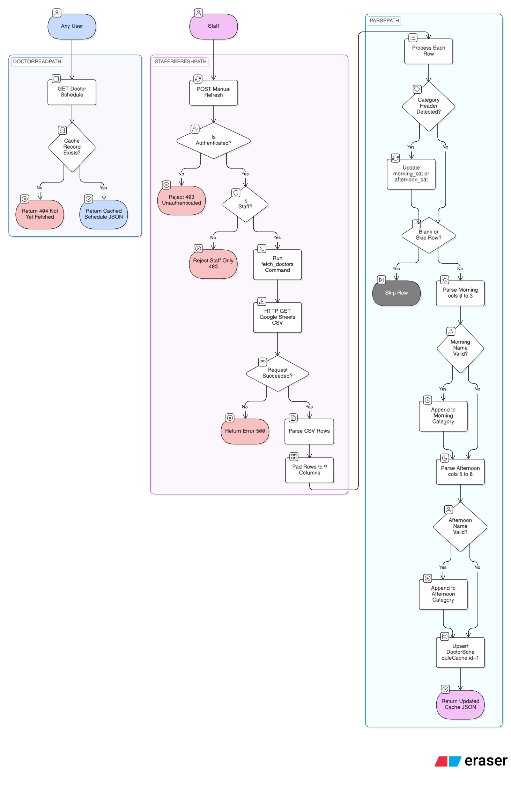
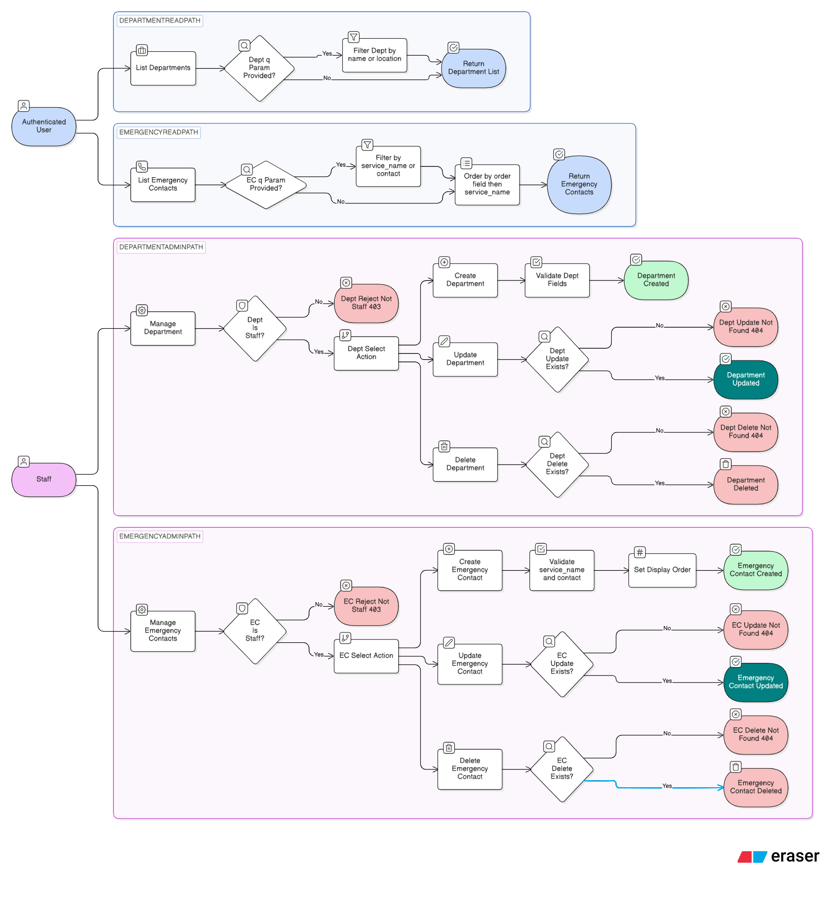
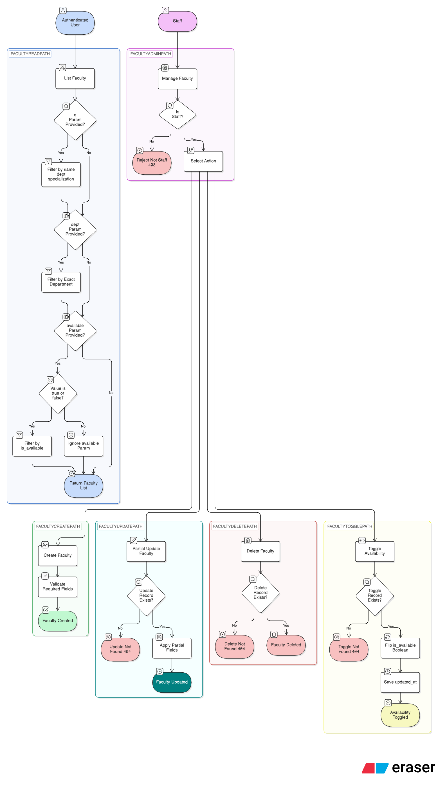
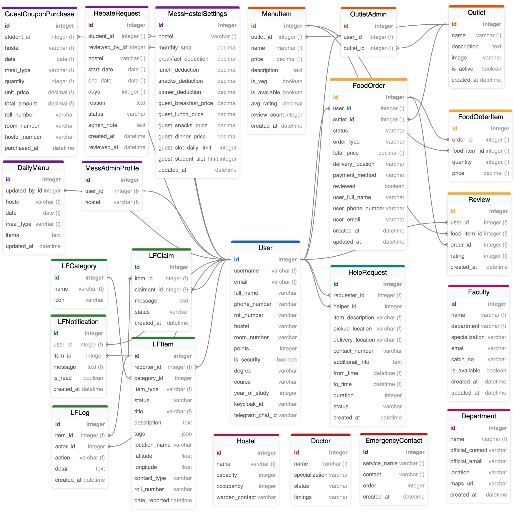
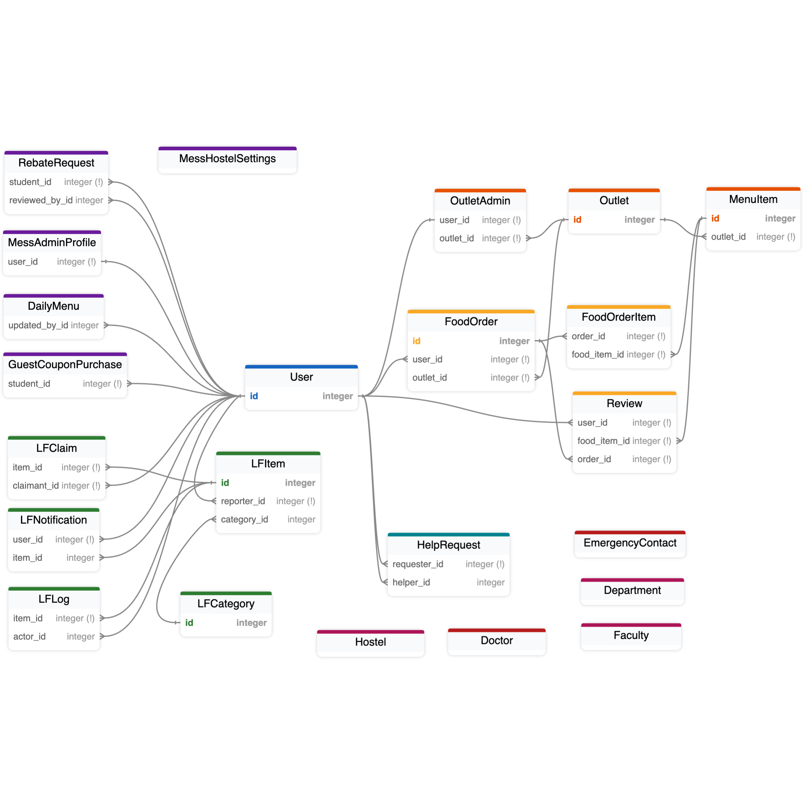
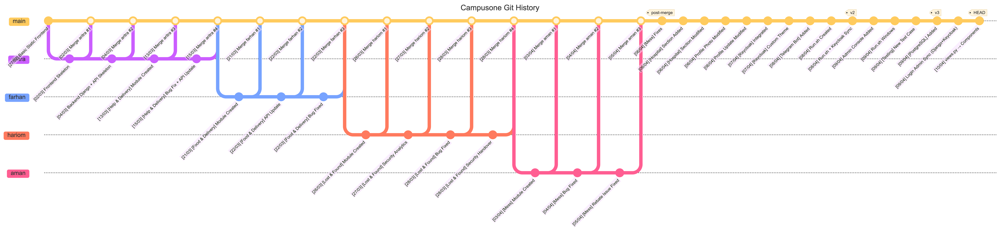

<p align="center">
  
</p>

<h1 align="center">CampusOne</h1>
<p align="center"><b>IIT Bombay Campus Portal</b></p>
<p align="center">
  <i>CS682 — Software Engineering · Team: Scalability Yoddhas</i>
</p>

<p align="center">
  <a href="https://github.com/belelaritra/Campusone"></a>
  
</p>

---

## About

CampusOne is a unified campus services platform built for IIT Bombay students and staff. It consolidates several disconnected workflows — `food ordering`, `lost & found`, `mess management`, `peer delivery`, `hospital schedules`, and `campus contacts` — into a single role-aware web app with a REST API, Keycloak SSO, and an optional Telegram Bot.

**Problem solved:** Students previously relied on scattered WhatsApp groups, unrelated third-party apps, physical notice boards, and PDFs to navigate daily campus life. CampusOne replaces all of that with one identity-consistent, permission-enforced platform.

---

## Team — Scalability Yoddhas

| Member | GitHub | Module Ownership |
|---|---|---|
| Aritra Belel | [@belelaritra](https://github.com/belelaritra) | Help & Delivery · Telegram Bot |
| Hariom Mewada | [@hariom575](https://github.com/hariom575) | Lost & Found · Keycloak · Infrastructure |
| Farhan Jawaid | [@farru2610](https://github.com/farru2610) | Food Ordering · Hospital · Contacts |
| Aman Sharma | [@aman0985](https://github.com/aman0985) | Mess Management · Test Suite |

---

## Tech Stack

| Layer | Technology |
|---|---|
| Frontend | React 18 (Vite), Context API, Axios, Keycloak JS, PWA |
| Backend | Django 4 + Django REST Framework |
| Authentication | Keycloak 25 — OAuth2, RS256 JWT, JWKS |
| Database | PostgreSQL 16 (Dockerised) |
| Infrastructure | Docker Compose |
| Scheduling | APScheduler (nightly doctor fetch at midnight) |
| Bot | Telegram Bot API (`python-telegram-bot`) |

---

## 1. Installation & Setup

### Step 1 — Install prerequisites (once)

| Tool | Version | Install |
|---|---|---|
| **Docker Desktop** | 24+ | [docs.docker.com/get-docker](https://docs.docker.com/get-docker/) |
| Python | 3.11+ | `brew install python@3.13` |
| Node.js | 18+ | `brew install node` |
| jq | any | `brew install jq` |

### Step 2 — Open Docker Desktop

> Launch **Docker Desktop** from your Applications folder and wait until the whale icon in the menu bar says **"Docker Desktop is running"** before continuing. The startup script cannot start containers if Docker is not running.

### Step 3 — (Optional) Get a Telegram Bot token

Skip this step if you don't need the bot — you can always add it later.

1. Open Telegram → search **@BotFather**
2. Send `/newbot` → follow the prompts → copy the token (looks like `123456:ABCDEFabcdef…`)
3. Have it ready — `./run.sh` will ask for it when it prompts about the bot

### Step 4 — Clone & run

```bash
git clone https://github.com/belelaritra/Campusone.git
cd Campusone
chmod +x run.sh
./run.sh
```

That's it. The script handles everything automatically:

| # | What happens |
|---|---|
| 1 | Checks prerequisites |
| 2 | Asks about the Telegram bot (paste your token here, or skip) |
| 3 | Generates all `.env` files and secrets |
| 4 | Starts Docker → waits for Keycloak → configures realm, client, roles |
| 5 | Creates Python virtualenv → installs packages → runs migrations |
| 6 | Prompts for a Django superuser — **press Enter at both prompts** to use the defaults (`admin` / `admin12345`) |
| 7 | Syncs the superuser into Keycloak |
| 8 | Starts the React frontend (Vite) |
| 9 | Starts the Telegram bot (if you opted in) |

Press `Ctrl+C` to stop everything cleanly.

```bash
./run.sh --bot      # always include bot, skip the prompt
./run.sh --no-bot   # always skip bot
./run.sh --reset    # wipe Keycloak DB and start fresh
```

<details>
<summary>Manual setup (service by service) — click to expand</summary>

Use separate terminal tabs for each service.

**1 — Docker (Keycloak + PostgreSQL)**

```bash
docker compose up -d
# Wait ~30s, then:
chmod +x keycloak/setup-realm.sh && ./keycloak/setup-realm.sh
```

**2 — Django backend**

```bash
cd backend
python3 -m venv venv && source venv/bin/activate
pip install -r requirements.txt
python manage.py migrate
python manage.py createsuperuser   # press Enter at each prompt → admin / admin12345
python manage.py sync_keycloak
python manage.py runserver 0.0.0.0:8000
```

**3 — React frontend**

```bash
cd frontend && npm install && npm run dev
```

**4 — Telegram bot (optional)**

```bash
cd bot
python3 -m venv venv && source venv/bin/activate
pip install -r requirements.txt
python bot.py   # bot/.env must have TELEGRAM_BOT_TOKEN set
```

**Stop Docker**

```bash
docker compose down
```

</details>

---

## 2. Services & URLs

Once running, all services are available locally:

| Service | URL | Credentials |
|---|---|---|
| React App (PWA) | http://localhost:5173 | Keycloak SSO |
| Django REST API | http://localhost:8000/api | JWT Bearer |
| Django Admin | http://localhost:8000/admin | `admin` / `admin12345` (default) |
| Keycloak Console | http://localhost:8080/admin | `admin` / `admin` |
| App PostgreSQL | `localhost:5433` | `admin` / `admin` (db: `campusone`) |

---

## 3. Project Structure

<table>
<tr>
<td valign="top" width="50%">

**Root**

| File | Purpose |
|---|---|
| `run.sh` | Single startup script — **start here** |
| `docker-compose.yml` | Keycloak + PostgreSQL containers |

---

**`backend/` — Django**

| File | Purpose |
|---|---|
| `campus_portal/settings.py` | Django settings, Keycloak config, APScheduler |
| `campus_portal/urls.py` | Root URL conf → `/admin/` + `/api/` |
| `api/models.py` | All 20+ models across 6 domain groups |
| `api/serializers.py` | DRF serializers for all models |
| `api/urls.py` | 50+ URL patterns across all modules |
| `api/keycloak_authentication.py` | RS256 JWT verification → User provisioning |
| `api/bot_authentication.py` | X-Bot-Secret header auth for Telegram |

**`backend/api/views/` — Feature logic**

| File | Owns |
|---|---|
| `auth.py` | Profile CRUD · Telegram phone link |
| `help.py` | HelpRequest lifecycle · GPS · points |
| `food.py` | Outlets · orders · reviews · analytics |
| `lostfound.py` | LFItem · LFClaim · LFLog · suggestions |
| `mess.py` | Menu · SMA · coupons · rebates |
| `doctors.py` | DoctorScheduleCache read + refresh |
| `contacts.py` | Faculty · Department · EmergencyContact |
| `console.py` | Staff master analytics console |
| `utils.py` | Shared helpers (haversine, etc.) |

**`backend/api/management/commands/`**

| File | Purpose |
|---|---|
| `fetch_doctors.py` | Google Sheets CSV → `DoctorScheduleCache` |
| `sync_keycloak.py` | Push Django users → Keycloak realm |
| `seed_food_outlets.py` | Seed fixture data for outlets + menu |

</td>
<td valign="top" width="50%">

**`frontend/src/` — React PWA**

| File / Folder | Purpose |
|---|---|
| `main.jsx` | `Keycloak.init()` → `ReactDOM.render()` |
| `App.jsx` | Route tree — public + `ProtectedRoute` |
| `keycloak.js` | Singleton Keycloak JS adapter |
| `services/api.js` | Axios · Bearer token · 401 retry queue |
| `context/AuthContext.jsx` | Keycloak auth + Django `/auth/me/` profile |
| `context/CartContext.jsx` | Food cart state (items, totals) |
| `context/AppContext.jsx` | Shared app-level state |
| `components/` | Sidebar · CartModal · Modal · Tabs · UI |
| `layouts/MainLayout.jsx` | Sidebar + page outlet wrapper |
| `pages/` | One file per module — 17 pages total |

---

**`bot/` — Telegram Bot**

| File | Purpose |
|---|---|
| `bot.py` | `ConversationHandler` — 12 typed states |
| `api_client.py` | `httpx` async calls to Django API |

---

**`keycloak/`**

| File | Purpose |
|---|---|
| `setup-realm.sh` | Realm · client · roles · test user |
| `themes/campusone/` | Custom IIT Bombay login theme |

---

**`diagrams/`**

| Folder | Contents |
|---|---|
| `HLD/` | High-level architecture diagram |
| `ER/` | Entity Relationship diagrams |
| `Flow/` | Module logic flow diagrams (21 total) |
| `Git/` | Git branch history graph |

</td>
</tr>
</table>

---

## 4. High-Level Architecture



**Key architectural decisions:**

| Decision | Rationale |
|---|---|
| Keycloak for SSO | Offloads all password management, token issuance, and key rotation — Django never touches passwords |
| RS256 JWT verified in-process | PyJWKClient caches RSA keys for 5 min; zero per-request Keycloak round-trips |
| PostgreSQL + `select_for_update` | ACID transactions are mandatory for concurrent operations (help accept, L&F claim) |
| APScheduler in-process | Only one nightly job — no Celery + Redis overhead needed |
| Telegram bot as thin HTTP client | All business logic stays in Django; bot is a pure HTTP client with no separate DB |
| React PWA | One codebase installable on Android + iOS, silent SSO via Keycloak JS adapter |

---

## 5. API Reference

All endpoints are prefixed `/api/`. Authentication is `Authorization: Bearer <JWT>` unless noted.

### Auth

| Method | Endpoint | Access |
|---|---|---|
| GET / PATCH | `/auth/me/` | Authenticated |
| POST | `/bot/link-phone/` | X-Bot-Secret |

### Help & Delivery

| Method | Endpoint | Access |
|---|---|---|
| GET / POST | `/help/` | Authenticated |
| POST | `/help/{id}/accept/` | Authenticated |
| POST | `/help/{id}/complete/` | Requester only |
| GET | `/help/mine/` | Authenticated |
| GET | `/help/history/` | Authenticated |
| GET | `/help/admin_list/` | Staff only |

### Food Ordering — User

| Method | Endpoint | Access |
|---|---|---|
| GET | `/food/outlets/` | Authenticated |
| GET | `/food/outlets/{id}/menu/` | Authenticated |
| POST | `/food/orders/` | Authenticated |
| GET | `/food/orders/pending/` | Authenticated |
| GET | `/food/orders/history/` | Authenticated |
| GET | `/food/orders/{id}/` | Order owner |
| POST | `/food/orders/{id}/cancel/` | Order owner |
| POST | `/food/orders/{id}/review/` | Order owner |

### Food Ordering — Admin & Analytics

| Method | Endpoint | Access |
|---|---|---|
| GET/POST/PATCH/DELETE | `/food/admin/menu/` | Outlet Admin |
| GET | `/food/admin/orders/` | Outlet Admin |
| POST | `/food/admin/orders/{id}/{action}/` | Outlet Admin |
| GET | `/food/analytics/hostel-wise/` | Outlet Admin |
| GET | `/food/analytics/daily-sales/` | Outlet Admin |
| GET | `/food/analytics/top-food-items/` | Outlet Admin |

### Lost & Found

| Method | Endpoint | Access |
|---|---|---|
| GET/POST/PATCH/DELETE | `/lf/items/` | Authenticated |
| POST | `/lf/items/{id}/interact/` | Authenticated |
| POST | `/lf/items/{id}/resolve/` | Reporter / Security |
| POST | `/lf/items/{id}/revert/` | Reporter / Security |
| GET | `/lf/items/{id}/suggestions/` | Authenticated |
| GET | `/lf/analytics/` | Authenticated |
| GET | `/lf/analytics/top-lost-locations/` | Security only |
| GET / PATCH | `/lf/notifications/` | Authenticated |

### Mess

| Method | Endpoint | Access |
|---|---|---|
| GET / PATCH | `/mess/settings/` | Authenticated / Admin |
| GET / POST | `/mess/menu/` | Authenticated / Admin |
| GET | `/mess/sma/` | Authenticated |
| GET / POST | `/mess/coupons/` | Authenticated |
| GET / POST | `/mess/rebates/` | Authenticated |
| POST | `/mess/rebates/{id}/review/` | Mess Admin |

### Hospital & Contacts

| Method | Endpoint | Access |
|---|---|---|
| GET | `/doctors/schedule/` | Public |
| POST | `/doctors/schedule/` | Staff only |
| GET/POST/PATCH/DELETE | `/contacts/faculty/` | Auth (read) / Staff (write) |
| GET/POST/PATCH/DELETE | `/contacts/departments/` | Auth (read) / Staff (write) |
| GET/POST/PATCH/DELETE | `/contacts/emergency/` | Auth (read) / Staff (write) |

### Admin Console

| Method | Endpoint | Access |
|---|---|---|
| GET | `/console/stats/` | Staff only |
| CRUD | `/console/users/`, `/console/outlets/` etc. | Staff only |

---

## 6. Logic Flow Diagrams

---

### Help & Delivery

#### Request Creation
Student submits a pickup request — server validates the time window, computes `to_time`, enforces one of 3 fixed pickup locations, and saves the request as `PENDING`.  
`backend/api/views/`[help.py](backend/api/views/help.py)


---

#### Accept Request
The most complex endpoint. Validates GPS coordinates via haversine (200 m radius), checks the helper isn't the requester, checks no other active accepted request exists, then locks the row with `select_for_update` before marking `ACCEPTED` — eliminating double-accept races.  
`backend/api/views/`[help.py](backend/api/views/help.py)


---

#### Complete Request
Requester-only action on an `ACCEPTED` request. Atomically marks the request `COMPLETED` and increments the helper's `points` by 1 in the same transaction.  
`backend/api/views/`[help.py](backend/api/views/help.py)


---

#### Delete Request
Requester-only; only allowed while status is `PENDING`. Returns 400 if the request has already been accepted or completed.  
`backend/api/views/`[help.py](backend/api/views/help.py)


---

#### Auto Expiry
No background task needed — a `bulk_update` runs on every list/mine call, flipping all requests where `to_time < now()` to `EXPIRED`. Also fires inline on any accept attempt.  
`backend/api/views/`[help.py](backend/api/views/help.py)


---

#### Edit Request
Requester-only edit; only allowed while the request is still `PENDING`. Updates pickup/delivery location, description, and time window; recomputes `to_time` server-side.  
`backend/api/views/`[help.py](backend/api/views/help.py)


---

### Food Ordering

#### Place Order
Validates outlet is active, all items belong to the same outlet, and quantity is 1–5. Snapshots each item's price and the user's contact info into `FoodOrderItem` and `FoodOrder` at placement — immune to future price changes.  
`backend/api/views/`[food.py](backend/api/views/food.py)


---

#### Admin Accept / Advance Order
Outlet admin steps an order through a strictly enforced state machine. Skipping a state returns `400` with the expected next status listed in the error body. Delivery and takeaway paths have different allowed transitions.  
`backend/api/views/`[food.py](backend/api/views/food.py)


---

#### Admin Cancel
Outlet admin cancels an order. Not allowed once the order has reached `DELIVERED` or `PICKED_UP`. Returns `400` if cancellation is attempted on a terminal state.  
`backend/api/views/`[food.py](backend/api/views/food.py)


---

#### User Cancel
Order owner cancels their own order. Only permitted while status is `PENDING`; returns `403` for anyone else and `400` if the order has already been accepted.  
`backend/api/views/`[food.py](backend/api/views/food.py)


---

#### Menu Management
Outlet admin creates, updates, or removes menu items. Price changes do not affect previously placed orders due to price snapshotting at order placement time.  
`backend/api/views/`[food.py](backend/api/views/food.py)


---

#### Analytics
Revenue and order analytics scoped strictly to the outlet admin's own outlet. Provides hostel-wise delivery breakdown and daily sales for the last 30 days.  
`backend/api/views/`[food.py](backend/api/views/food.py)


---

### Lost & Found

#### Post Item
Student posts a LOST or FOUND item. Location auto-resolves via GPS haversine if the location name is omitted. FOUND items enforce an ID card rule before going live as `AVAILABLE`.  
`backend/api/views/`[lostfound.py](backend/api/views/lostfound.py)


---

#### Claim
A user claims an AVAILABLE item. Runs a pre-transaction check, then a `select_for_update` re-check inside a transaction. A DB-level `UniqueConstraint` on `(item, status=PENDING)` is the final safety net — `IntegrityError` caught and returned as `409`.  
`backend/api/views/`[lostfound.py](backend/api/views/lostfound.py)


---

#### Resolve & Revert
Items held at the security office (`contact_type=SECURITY`) can only be resolved by security staff. Resolution triggers a notification to the claimant. Revert returns the item to `AVAILABLE`.  
`backend/api/views/`[lostfound.py](backend/api/views/lostfound.py)


---

#### Contact Visibility
Phone numbers are hidden by default. They are revealed only to the directly involved parties (reporter ↔ claimant) once a claim is in `PENDING` or later state.  
`backend/api/views/`[lostfound.py](backend/api/views/lostfound.py)


---

#### Edit & Delete
Reporter-only; only permitted while the item is still `AVAILABLE`. Editing updates tags, description, and location. Deletion removes the item and its associated logs.  
`backend/api/views/`[lostfound.py](backend/api/views/lostfound.py)


---

#### Analytics
Shows item type distribution, top loss locations, and resolution rates. The top-lost-locations endpoint is security-staff only.  
`backend/api/views/`[lostfound.py](backend/api/views/lostfound.py)


---

### Mess Management

#### Daily Menu Upsert
One record per `(hostel, date, meal_type)`. POST always upserts — no separate update call needed. Mess admin can update any hostel; students can only read.  
`backend/api/views/`[mess.py](backend/api/views/mess.py)


---

#### SMA Balance
Computes the student's remaining mess balance: `semester_sma − daily_deductions − guest_extras`. Approved rebate days are excluded from the deduction count.  
`backend/api/views/`[mess.py](backend/api/views/mess.py)



---

#### Guest Coupon Purchase
Two sequential atomic checks before any coupon is created: per-student count ≤ 10, then slot total ≤ 50. Both are rechecked inside a `select_for_update` to prevent overselling.  
`backend/api/views/`[mess.py](backend/api/views/mess.py)


---

#### Rebate Request
Student submits a leave period. Hostel format is normalised (`H14` ↔ `hostel_14`) before saving. Only future or current-semester dates are accepted; maximum span is 15 days.  
`backend/api/views/`[mess.py](backend/api/views/mess.py)



---

#### Rebate Review
Mess admin approves or rejects a `PENDING` rebate for their own hostel. Cross-hostel review returns `403`. Approved rebates are excluded from the SMA deduction formula.  
`backend/api/views/`[mess.py](backend/api/views/mess.py)


---

#### Mess Settings
Hostel-level configuration (meal prices, guest slot limits, semester SMA). Staff can update any hostel; students read their own hostel's settings.  
`backend/api/views/`[mess.py](backend/api/views/mess.py)


---

### Hospital & Contacts

#### Doctor Schedule
OPD schedule is fetched from the institute's official Google Sheets CSV, parsed from a dual-column morning/afternoon layout, cleaned of stale headers, and cached as a single `DoctorScheduleCache` row. Staff can trigger a manual refresh.  
`backend/api/views/`[doctors.py](backend/api/views/doctors.py) · `backend/api/management/commands/`[fetch_doctors.py](backend/api/management/commands/fetch_doctors.py)



---

#### Emergency Contacts
Ordered by `priority` field. All authenticated users can read; only staff can create, edit, or delete. Contact numbers are always visible — no visibility gating.  
`backend/api/views/`[contacts.py](backend/api/views/contacts.py)



---

#### Faculty Directory
Faculty can be filtered by name, department, specialisation, and availability. Phone numbers follow the same visibility rules as Lost & Found contact gating.  
`backend/api/views/`[contacts.py](backend/api/views/contacts.py)



---

## 7. Entity Relationship Diagram

The schema spans **20 tables** across 6 domain groups: User, Help & Delivery, Food Ordering, Lost & Found, Mess Management, and Campus Info.

<p align="center">
  
</p>

<details>
<summary>Keys-only view — click to expand</summary>
<p align="center">
  
</p>
</details>

Key structural decisions:
- **User** — extends Django's `AbstractUser` with `points`, `hostel`, `keycloak_id`, `telegram_chat_id`, and academic profile fields
- **HelpRequest** — nullable `helper_id` FK to User; null until a helper accepts
- **FoodOrder** — snapshots `total_price`, `user_full_name`, `user_phone_number`, `user_email` at placement — immutable to future catalogue changes
- **LFClaim** — DB-level `UniqueConstraint` on `(item, status=PENDING)` — only one pending claim per item ever
- **DailyMenu** — `unique_together (hostel, date, meal_type)` — POST is always an upsert
- **DoctorScheduleCache** — single-row table (`id=1`) storing the full parsed OPD schedule as a `JSONField`

---

## 8. Git Branching Strategy

The team used a **feature-branch workflow** — one branch per module owner, merged to `main` at integration points.

<p align="center">
  
</p>

| Branch | Owner | Module |
|---|---|---|
| [`main`](https://github.com/belelaritra/Campusone/tree/main) | All | Integration: bot + Hospital + Keycloak + PostgreSQL |
| [`aritra`](https://github.com/belelaritra/Campusone/tree/aritra) | Aritra Belel | Help & Delivery |
| [`hariom`](https://github.com/belelaritra/Campusone/tree/hariom) | Hariom Mewada | Lost & Found |
| [`farhan`](https://github.com/belelaritra/Campusone/tree/farhan) | Farhan Jawaid | Food Ordering |
| [`aman`](https://github.com/belelaritra/Campusone/tree/aman) | Aman Sharma | Mess Management |

Issues were labelled by module (`help-delivery`, `food`, `lostfound`, `mess`, `auth`) and type (`bug`, `feature`, `enhancement`). Each issue was resolved on the owning branch and merged to `main` via pull requests.

---

## 9. Keycloak — Assigning Roles

1. Open http://localhost:8080/admin → login `admin` / `admin`
2. Switch to the `campusone` realm (top-left dropdown)
3. Go to **Users** → select a user → **Role Mapping** tab → **Assign role**

Available roles:

| Role | Access |
|---|---|
| `campus-staff` | Full analytics, admin console, all data |
| `campus-security` | Security-specific features (L&F resolution, top-lost-locations) |
| `outlet-admin` | Manage a specific food outlet (also needs `OutletAdmin` row in Django Admin) |
| `mess-admin` | Manage a specific hostel mess (also needs `MessAdminProfile` row in Django Admin) |

Role changes take effect on the user's next login.

---

## 10. Environment Files

`run.sh` generates and persists all secrets automatically. Never commit these files — they are in `.gitignore`.

| File | Key Variables |
|---|---|
| `backend/.env` | `DJANGO_SECRET_KEY`, `TELEGRAM_BOT_SECRET`, `DB_*` |
| `bot/.env` | `TELEGRAM_BOT_TOKEN`, `TELEGRAM_BOT_SECRET`, `DJANGO_API_URL` |
| `frontend/.env.local` | Keycloak URL, realm, client ID, API URL |

To generate manually:

```bash
cp backend/.env.example backend/.env
cp bot/.env.example bot/.env

# Django secret key
python3 -c "import secrets, string; chars = string.ascii_letters + string.digits + '!@#\$%^&*(-_=+)'; print(''.join(secrets.choice(chars) for _ in range(50)))"

# Bot shared secret
python3 -c "import secrets; print(secrets.token_hex(32))"
```

---

## 11. Troubleshooting

| Symptom | Fix |
|---|---|
| `No module named 'dotenv'` | Activate the venv: `source backend/venv/bin/activate` |
| `No module named 'psycopg2'` | `pip install psycopg2-binary` inside the backend venv |
| `could not connect to server` | App DB not running — `docker compose up -d` |
| Docker won't start | Open Docker Desktop application and wait for it to show "running" |
| Keycloak not reachable | `docker compose up -d`, then wait ~30s |
| Redirect loop on login | Re-run `./keycloak/setup-realm.sh` |
| 401 on all API calls | `KEYCLOAK_SERVER_URL` in `settings.py` must be `http://localhost:8080` |
| User logs in but blank profile | `python manage.py sync_keycloak` inside activated backend venv |
| Bot: "No account found" | Save your phone number in Profile on the web app first |
| Bot: 403 errors | `TELEGRAM_BOT_SECRET` mismatch — re-run `./run.sh` to regenerate |
| Doctor schedule stale | Trigger manual refresh: POST `/api/doctors/schedule/` as staff user |
| `APScheduler failed to start` | `pip install -r requirements.txt` inside backend venv |

---

## 12. Full Reset

Wipes Docker volumes, databases, virtualenvs, node_modules, caches, and generated `.env` files.

```bash
# Stop everything first (Ctrl+C if run.sh is active), then:

docker compose down -v
rm -f backend/.env bot/.env frontend/.env.local .campusone.log .campusone.pids
rm -rf backend/venv bot/venv frontend/node_modules frontend/.vite frontend/dist

find . -not -path "*/node_modules/*" -not -path "*/.git/*" \
  \( -type d -name __pycache__ -o -name "*.pyc" \) \
  -exec rm -rf {} + 2>/dev/null; \
./run.sh
```

**One-liner:**

```bash
docker compose down -v && \
rm -f backend/.env bot/.env frontend/.env.local .campusone.log .campusone.pids && \
rm -rf backend/venv bot/venv frontend/node_modules frontend/.vite frontend/dist && \
find . -not -path "*/node_modules/*" -not -path "*/.git/*" \
  \( -type d -name __pycache__ -o -name "*.pyc" \) \
  -exec rm -rf {} + 2>/dev/null; \
./run.sh
```

---

## 13. Testing

Test infrastructure: **pytest** with a pure-mock architecture — no database or running server required.

| Module | Test File | Tests | Status |
|---|---|---|---|
| Help & Delivery | `tests/help_delivery/test_help_unit.py` | — | Pass |
| Food Ordering | `tests/food_ordering/test_food_unit.py` | — | Pass |
| Lost & Found | `tests/lost_found/test_lf_unit.py` | — | Pass |
| Mess Management | `tests/mess/test_mess_unit.py` | — | Pass |
| Contacts & Doctors | `tests/contacts_doctors/` | — | Pass |
| **Total** | | **175** | **175 / 175** |

Run the full suite:

```bash
cd backend
source venv/bin/activate
pytest tests/ -v
```

---

<p align="center">
  CS682 · Software Engineering · IIT Bombay<br/>
  Team <b>Scalability Yoddhas</b>
</p>
