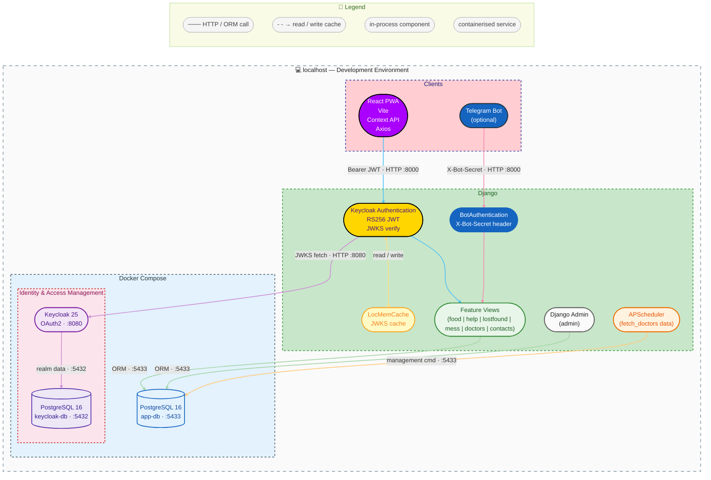

```mermaid
---
config:
  theme: mc
---
flowchart LR
 subgraph Clients["Clients"]
    direction TB
        PWA(["React PWA<br>Vite<br>Context API<br>Axios"])
        BOT(["Telegram Bot<br>(optional)"])
  end
 subgraph Django["Django"]
    direction TB
        KC_AUTH(["Keycloak Authentication<br>RS256 JWT<br>JWKS verify"])
        BOT_AUTH(["BotAuthentication<br>X-Bot-Secret header"])
        CACHE(["LocMemCache<br>JWKS cache"])
        SCHED(["APScheduler<br>(fetch_doctors data)"])
        VIEWS(["Feature Views<br>(food | help | lostfound | mess | doctors | contacts)"])
        ADMIN(["Django Admin<br>(admin)"])
  end
 subgraph IAM["Identity &amp; Access Management"]
        KC(["Keycloak 25<br>OAuth2 · :8080"])
        KC_PG[("PostgreSQL 16<br>keycloak-db · :5432")]
  end
 subgraph Docker["Docker Compose"]
    direction TB
        PG[("PostgreSQL 16<br>app-db · :5433")]
        IAM
  end
 subgraph ENV["💻  localhost — Development Environment"]
        Clients
        Django
        Docker
  end
 subgraph LEGEND["📖  Legend"]
    direction TB
        LG1(["─── HTTP / ORM call"])
        LG2(["- - → read / write cache"])
        LG3(["in-process component"])
        LG4(["containerised service"])
  end
    PWA -- Bearer JWT · HTTP :8000 --> KC_AUTH
    BOT -- "X-Bot-Secret · HTTP :8000" --> BOT_AUTH
    KC_AUTH -- JWKS fetch · HTTP :8080 --> KC
    KC_AUTH <-- read / write --> CACHE
    BOT_AUTH --> VIEWS
    KC_AUTH --> VIEWS
    VIEWS -- ORM · :5433 --> PG
    ADMIN -- ORM · :5433 --> PG
    SCHED -- management cmd · :5433 --> PG
    KC -- realm data · :5432 --> KC_PG

    style PWA      fill:#AA00FF,color:#ffffff,stroke:#000000,stroke-width:2px
    style BOT      fill:#1565c0,color:#ffffff,stroke:#263238,stroke-width:2px
    style KC_AUTH  fill:#FFD600,color:#4a148c,stroke:#000000,stroke-width:2px
    style BOT_AUTH fill:#1565c0,color:#ffffff,stroke:#1565c0,stroke-width:2px
    style CACHE    fill:#fff9c4,color:#f57f17,stroke:#f9a825,stroke-width:2px
    style SCHED    fill:#fff3e0,color:#e65100,stroke:#ef6c00,stroke-width:2px
    style VIEWS    fill:#e8f5e9,color:#1b5e20,stroke:#388e3c,stroke-width:2px
    style ADMIN    fill:#fafafa,color:#212121,stroke:#616161,stroke-width:2px
    style PG       fill:#e3f2fd,color:#0d47a1,stroke:#1565c0,stroke-width:2px
    style KC       fill:#f3e5f5,color:#4a148c,stroke:#7b1fa2,stroke-width:2px
    style KC_PG    fill:#ede7f6,color:#311b92,stroke:#512da8,stroke-width:2px
    style LG1      fill:#f5f5f5,color:#424242,stroke:#bdbdbd,stroke-width:1px
    style LG2      fill:#f5f5f5,color:#424242,stroke:#bdbdbd,stroke-width:1px
    style LG3      fill:#f5f5f5,color:#424242,stroke:#bdbdbd,stroke-width:1px
    style LG4      fill:#f5f5f5,color:#424242,stroke:#bdbdbd,stroke-width:1px
    style Clients fill:#FFCDD2,color:#1a237e,stroke:#3949ab,stroke-width:2px,stroke-dasharray:5
    style Django  fill:#C8E6C9,color:#1b5e20,stroke:#43a047,stroke-width:2px,stroke-dasharray:5
    style Docker  fill:#e3f2fd,color:#263238,stroke:#546e7a,stroke-width:2px,stroke-dasharray:5
    style IAM     fill:#fce4ec,color:#880e4f,stroke:#c62828,stroke-width:2px,stroke-dasharray:4
    style ENV     fill:#fafafa,color:#212121,stroke:#90a4ae,stroke-width:2px,stroke-dasharray:8
    style LEGEND  fill:#f9fbe7,color:#33691e,stroke:#aed581,stroke-width:1px
    linkStyle 0 stroke:#4fc3f7,stroke-width:2px,fill:none
    linkStyle 1 stroke:#f48fb1,stroke-width:2px,fill:none
    linkStyle 2 stroke:#ce93d8,stroke-width:2px,fill:none
    linkStyle 3 stroke:#ffe082,stroke-width:2px,fill:none
    linkStyle 4 stroke:#f48fb1,stroke-width:2px,fill:none
    linkStyle 5 stroke:#4fc3f7,stroke-width:2px,fill:none
    linkStyle 6 stroke:#a5d6a7,stroke-width:2px,fill:none
    linkStyle 7 stroke:#a5d6a7,stroke-width:2px,fill:none
    linkStyle 8 stroke:#ffcc80,stroke-width:2px,fill:none
    linkStyle 9 stroke:#ce93d8,stroke-width:2px,fill:none
```
