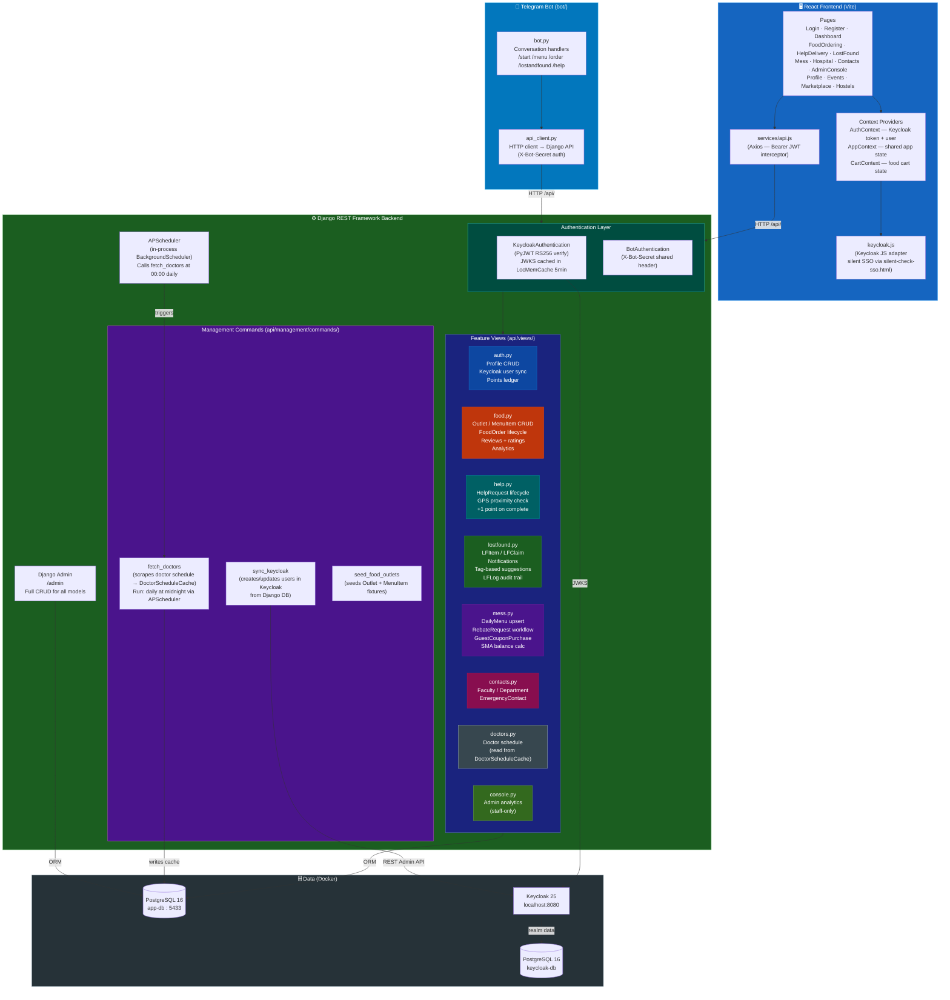

```mermaid
flowchart TD
    subgraph FE["🖥️ React Frontend (Vite)"]
        direction LR
        PAGES["Pages\nLogin · Register · Dashboard\nFoodOrdering · HelpDelivery · LostFound\nMess · Hospital · Contacts · AdminConsole\nProfile · Events · Marketplace · Hostels"]
        CTX["Context Providers\nAuthContext — Keycloak token + user\nAppContext — shared app state\nCartContext — food cart state"]
        AXIOS["services/api.js\n(Axios — Bearer JWT interceptor)"]
        KC_JS["keycloak.js\n(Keycloak JS adapter\nsilent SSO via silent-check-sso.html)"]
        PAGES --> CTX
        PAGES --> AXIOS
        CTX --> KC_JS
    end

    subgraph DRF["⚙️ Django REST Framework Backend"]
        direction TB

        subgraph AUTH_LAYER["Authentication Layer"]
            KCA["KeycloakAuthentication\n(PyJWT RS256 verify)\nJWKS cached in LocMemCache 5min"]
            BOTA["BotAuthentication\n(X-Bot-Secret shared header)"]
        end

        subgraph FEATURE_VIEWS["Feature Views  (api/views/)"]
            direction LR
            VAUTH["auth.py\nProfile CRUD\nKeycloak user sync\nPoints ledger"]
            VFOOD["food.py\nOutlet / MenuItem CRUD\nFoodOrder lifecycle\nReviews + ratings\nAnalytics"]
            VHELP["help.py\nHelpRequest lifecycle\nGPS proximity check\n+1 point on complete"]
            VLF["lostfound.py\nLFItem / LFClaim\nNotifications\nTag-based suggestions\nLFLog audit trail"]
            VMESS["mess.py\nDailyMenu upsert\nRebateRequest workflow\nGuestCouponPurchase\nSMA balance calc"]
            VCON["contacts.py\nFaculty / Department\nEmergencyContact"]
            VDOC["doctors.py\nDoctor schedule\n(read from DoctorScheduleCache)"]
            VCON2["console.py\nAdmin analytics\n(staff-only)"]
        end

        subgraph MGMT["Management Commands  (api/management/commands/)"]
            CMD1["fetch_doctors\n(scrapes doctor schedule → DoctorScheduleCache)\nRun: daily at midnight via APScheduler"]
            CMD2["sync_keycloak\n(creates/updates users in Keycloak\nfrom Django DB)"]
            CMD3["seed_food_outlets\n(seeds Outlet + MenuItem fixtures)"]
        end

        SCHED["APScheduler\n(in-process BackgroundScheduler)\nCalls fetch_doctors at 00:00 daily"]
        ADMIN["Django Admin\n/admin\nFull CRUD for all models"]
    end

    subgraph BOT["🤖 Telegram Bot  (bot/)"]
        BOTPY["bot.py\nConversation handlers\n/start /menu /order /lostandfound /help"]
        BOTAPI["api_client.py\nHTTP client → Django API\n(X-Bot-Secret auth)"]
        BOTPY --> BOTAPI
    end

    subgraph DATA["🗄️ Data (Docker)"]
        PG[("PostgreSQL 16\napp-db : 5433")]
        KC_SVC["Keycloak 25\nlocalhost:8080"]
        KC_PG[("PostgreSQL 16\nkeycloak-db")]
    end

    AXIOS -->|"HTTP /api/"| AUTH_LAYER
    AUTH_LAYER --> FEATURE_VIEWS
    FEATURE_VIEWS -->|"ORM"| PG
    ADMIN -->|"ORM"| PG
    SCHED -->|"triggers"| CMD1
    CMD1 -->|"writes cache"| PG
    CMD2 -->|"REST Admin API"| KC_SVC
    KCA -->|"JWKS"| KC_SVC
    KC_SVC -->|"realm data"| KC_PG
    BOTAPI -->|"HTTP /api/"| AUTH_LAYER

    style FE        fill:#1565C0,color:#fff,stroke:#42a5f5
    style DRF       fill:#1b5e20,color:#fff,stroke:#66bb6a
    style AUTH_LAYER fill:#004d40,color:#fff,stroke:#26a69a
    style FEATURE_VIEWS fill:#1a237e,color:#fff,stroke:#5c6bc0
    style MGMT      fill:#4a148c,color:#fff,stroke:#ab47bc
    style BOT       fill:#0277bd,color:#fff,stroke:#4fc3f7
    style DATA      fill:#263238,color:#fff,stroke:#90a4ae

    style VAUTH fill:#0d47a1,color:#fff,stroke:#1565c0
    style VFOOD fill:#bf360c,color:#fff,stroke:#e64a19
    style VHELP fill:#006064,color:#fff,stroke:#00838f
    style VLF   fill:#1b5e20,color:#fff,stroke:#2e7d32
    style VMESS fill:#4a148c,color:#fff,stroke:#6a1b9a
    style VCON  fill:#880e4f,color:#fff,stroke:#ad1457
    style VDOC  fill:#37474f,color:#fff,stroke:#90a4ae
    style VCON2 fill:#33691e,color:#fff,stroke:#689f38
```
